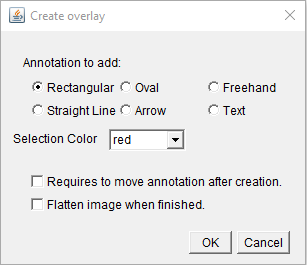

# Image annotation macro

ImageJ/Fiji macro to add a Rectangular, Oval, Freehand, Straight Line, Arrow or Text selection to an overlay. This annotation can be in red, green, blue, yellow, cyan, magenta, black, grey, white, orange or pink. The macro will ask the user after each annotation if more annotations are required. 

The user can select the start and end slice or frame for each of the selections. Very useful to annotate time series. The user can adjust the position of the annotation in case the object moves over time. Be aware that you might have to select the correct annotations in the ROI Manager if more than one annotation is available.

The user can chose to have the annotation as overlay or to flatten the image when finished. When an image is "flattened" the overlays are permanently "burned" onto the image and cannot be removed anymore. The macro should be able to handle all image types. Updated in August 2024 to resolve an issue with the flatten option causing all annotations to be visible on all slices in some formats. 

## Download code

Select the file "Annotation_to_overlayV1.6.ijm" and select "Raw" from the right side menu. Select all the code and copy and paste this into the text editor from ImageJ/Fiji (File > New > Text Window). Alternatively, you can download all files via the green "Code" button as a ZIP file and extract the macro file. Save this file in your macros sub-folder within the ImageJ or Fiji folder with the name Annotation_to_overlayV1.6.ijm.

## Run macro

To run the macro a single time open an image and via Plugins > Macros > Run... select the macro. Alternatively install it via Plugins > Macros > Install ... and the macro will be added to the Plugins > Macros menu, till you restart ImageJ/Fiji.

## Disclaimer

All the macros published on this repository can be used at your own risk. Although I did my best to ensure that they run as intended, there may be bugs, not expected use or changes to the ImageJ code that results in unexpected behaviour. If you notice a problem with any of the macros please let me know and I can try to solve the problem.

## Publications acknowledging this macro:

Vallardi G, Allan LA, Crozier L, Saurin AT (2019) Division of labour between PP2A-B56 isoforms at the centromere and kinetochore. Elife. 8:e42619. doi: 10.7554/eLife.42619.
